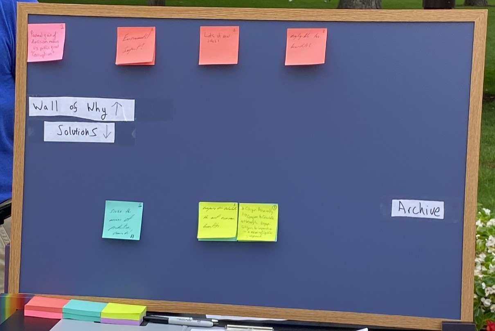
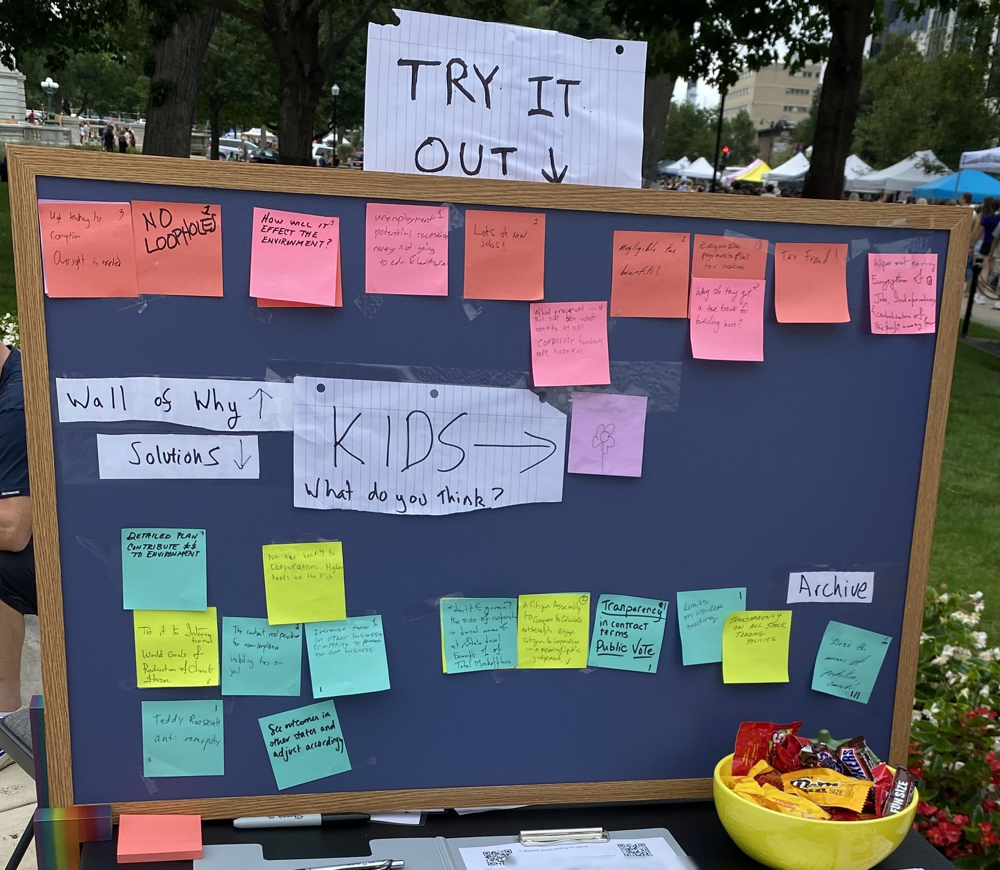
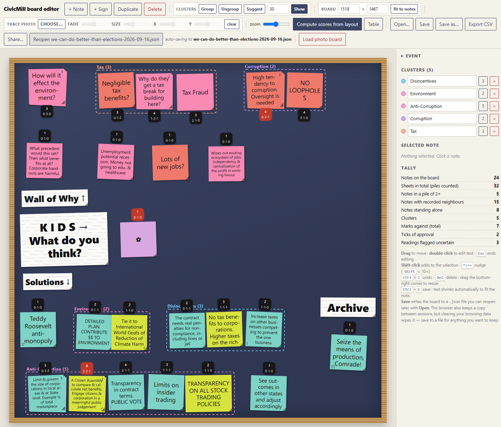

# The Saturday Board - The Foxconn Decision

**Location:**  Dane County Farmers' Market, Capitol Square, Madison, Saturday 5 September 2026

A group called Sortition USA believes there's a better way of making collective decisions than electing representatives, but 
that can only happen if people start to trust each other again. The report shows what happens when we give everyday people that chance!

In these dire days, many people are beginning to ask if there's a better way of making collective decisions 
than our current system. Electing well-meaning but narrow-minded—and narrowly funded—politicians yields 
decision outcomes that satisfy only the narrow desires of *funders* rather than *voters*! 
This observation is true regardless of political wing. For example, political newspaper articles 
often report the size of the election war-chest rather than the policies the election candidates support, because that's more useful information for 
election campaigns.

If we step past the idea that people from "other" political groups cause "all the problems",  we see immediately that robust policies that *actually work* for everyday people are avoided in favor of narrower policies. Sortition USA believes that's because everyday people simply 
aren't involved in making the decisions!

To make their point, every Saturday Sortition USA runs a simple experiment at Madison's Farmers' Market that is designed 
to build faith in the collective wisdom of our fellow citizens. 
Visitors to the market are invited to re-make complex historical decisions 
that were made by the state senators working in the capitol building behind them.  
Each person who stops by our stall and takes part in our challenge does a little 
bit of work using a noticeboard and lots of coloured post-it notes.

SUSA believes that—*with the right process*—everyday citizens are able to make great decisions 
in the face of complex challenges that are as wise as, if not wiser than, those made in the capitol building. 
SUSA's process is designed to capture the perspectives of arbitrary citizens allowing them to work together in a serial process
that produces decisions robust to criticism from the entire population. This kind of solution stands in direct contrast to 
decisions made by elected groups, which—regardless of who is in power—favour the narrow viewpoints of rich sponsors.

The important point isn't eloquence or intelligence, or access to secret and privileged information, or being "the right kind of person". 
The important point is that removing the tribal labels attached to ideas allows everyday people to become more open-minded and listen to other people. 
Our process allows individuals to feel heard—the first thing we do is ask them to name their pain! In return, they listen back to those who have different opinions.
Our process encourages learning across differences thereby allowing robust solutions to be found. The end result is that the *system* moves away from default positions and finds solutions that no one person or party advocates above all others.

The narrow-band winner-takes-all property of most election systems results in decisions that are fragile; and this flaw cuts 
both ways on the political spectrum. Over time, everyone loses and becomes more and more desperate to lock in their positions and 
make changes irreversible, leading to polarization and divided societies. To combat these undesirable social traits, 
democracies around the world are beginning to experiment with participatory solutions a bit like Sortition USA's post-it note system but 
more sophisticated, and they are finding that the solutions discovered with wide-band deliberative input actually benefit both 
sides of the political spectrum!

This report shows what happened on Saturday 5th September when we presented this challenge to everyday people at the farmers' market and put them in the hotseat 
to re-make the famous Foxconn decision!

Our punters were told only the following: 

"A famous company will build a large electronics factory in the state, but only 
if the state pays it billions in tax-incentives that could have gone somewhere else. 
What should the state do?"

By the end of the day the board had been visited by around 20 people and
held 24 stacks of post it notes:

*The board at the start of the day (10 am).*

*The same board a few hours later (1 pm).*

---

## How the board works

After hearing the brief, visitors write down one issue they might experience as individuals in relation to the brief. 
They are also asked to provide a knee-jerk, off-the-top-of-their-head solution to the question. 
The pain points they express are entered into our ledger on the top row using pink and coral post-it notes—we call this top row the "Wall of Why"—and 
initial guessed solutions go on the bottom row, in aqua and lime post-it notes.

The decision maker is then asked to place their ideas in the right place on the board. 

That forces the punter to read *all* the notes that are exposed on the board.  There aren't that many individual piles and it doesn't take long. It's important 
they take their time to look at all the notes that they can see because it is up to the punter to choose where to file their ideas in the ledger. The place 
where they choose to position their idea is a key part of the decision making process. 

A key psychological point emerges here. Suddenly, the decision maker is tasked with a simple mechanical task. They must use their brain to evaluate similarity and differences with their note and all the other notes. Their panic is "I hope I put this in the right spot", not "Look at what that dingus said". They are not judging or evaluating the correctness of other notes, only the similarity or difference of their own notes versus a whole host of other ideas.

The location of the note and the notes it is near, will affect the final outcome, as much as what is written on the note. 
If the ideas they wrote down are a close match with something already on the board, they put theirs on top of the original note. 
Stacking a note on top of another is how you agree with it - it's like voting. If their idea was closely related but not quite the same, then they put it slightly to 
one side of the original note. That note will act to support the notes around it, because it is in the same family of ideas. In that way, unlike voting, split decisions on minor options, don't divide the major field. You can formally support an idea *similar* to yours at the same time as pursuing your version of it.  If the idea the respondent thought of is genuinely completely different from anything already on the board, they are able to start a whole new solution class. And it is *their* decision to make! Not the stewards. Not sortition USA. Theirs. 

Next, we gave our hard working market goer the chance to improve the wording on a note, by adding one new pain point and one new or revised idea.  We ask them at this point, to consider all the pain points on the board. Don't respond in response to your idea. Just if you see anywhere that a change to policy would stop making someone's pain worse. 

Finally, they are allowed to assign tally marks against ideas they *dislike*. They can supply up to three strokes - no more than two on one post it note and they are not allowed to delete their own notes. These anti-votes take ideas away rather than add to the board. If an idea gets a total of three strokes then the note comes off. Again, we ask the individual to only remove ideas that they can see would increase the pain noted on the wall-of-why.  Punters are not asked to judge *their own* pain. They are asked to judge other people's pain.  Their pain is already addressed by their idea, and they are not allowed to delete their idea. Just as the judgement of their ideas is left to other people, so they must judge other people's solutions based on whether or not those other ideas would increase, or decrease the pain of *other* people.

Run for long enough, with enough people, the board settles down into a steady state. This is a method we devised using our general knowledge of deliberative processes and common sense. Ideas are added, and each visitor does a little work on them to keep them or take them away. Over time, the expressed ideas evolve and are improved as people drift by. Once the solution space has been fully sampled, ideas stop spreading sideways and start stacking up. 

Where the system settles is what we are testing. We are fine tuning our algorithm in terms of how many turns a person gets, and how many strikes they are allowed, and so on. 

## How the winner is picked

The winner is not simply the tallest stack.

Supporting notes count as well. The score of a given post-it note is its own depth (how many layers of post it notes it has) plus the depth of the neighbours on either side.  Thus a cluster of related solutions props up the peak closest to them, even if there's a bit of difference in how it should be worded. That way an idea sitting in the middle of a busy colony scores higher than the same idea sitting out on its own. A tall stack with nothing beside it does not win.

The reason is robustness. If an idea only survives in exactly the words one
person wrote, it is fragile. If the people around it were reaching for the same
thing in different words, it holds up when you nudge it. Scoring breadth
alongside height is how the board prefers ideas that survive being rephrased.

In practice each note scores its own stack plus the stacks immediately left and
right of it, and the scoring stops at the edge of a colony. Notes more than a
hand's width apart are in different colonies and do not help each other.

*Using AI, we transcribed the results of the board into a digital version and input the virtual post it notes into a small tool built for the job, 
which automatically generates the scores for each post it note. The data from the process is recorded: what each note said, where it sat, and how many sheets
were stacked on it. Dashed outlines are separate colonies. Red is the winner. Red strokes are votes against. The archive is record of ideas that were deleted from the main pool. *Important*: Due to limited space on the board on the day, some compression of "colonies" occurred in the photographic evidence, but we were able to separate these out into the different camps afterwards. This highlights the strict rules and standard to which stewards must be held to not interfere in the results. There is a clear separation of process from content, much like in a court, where professionals like court clerks run the process and ensure protocol is followed and documented without getting involved in the discussion.*

---

## The readout: the Wall of Why

This is a transcribed summary of the top ledger—the pink notes—written so as to be legible here. Ten notes, fifteen sheets, seven colonies. 
We only report the top message on each pile. The other messages beneath are similar enough that someone thought theirs was the same. 

| Colony | Notes | Sheets | What people said |
|---|---|---|---|
| **Tax** | 3 | 4 | Negligible tax benefits? · Why do they get a tax break for building here? · Tax Fraud |
| **Corruption** | 2 | 4 | High tendency to corruption, oversight is needed · NO LOOPHOLES |
| Environment | 1 | 3 | How will it effect the environment? |
| — | 1 | 1 | What precedent would this set? Corporate handouts are harmful. |
| — | 1 | 1 | Unemployment, potential recession. Money not going to edu. & healthcare |
| — | 1 | 1 | Lots of new jobs? |
| — | 1 | 1 | Wipes out existing ecosystem of jobs |

The two heaviest worries were the tax case and corruption. They are level on weight with
the tax issues phrased in a broader range of ways. The environment drew the tallest single stack: three
people in a row put their note on that one spot - but note that it is a fragile problem. It stands alone with little support. It's possible, from this very small amount of evidence, that "Protecting the Environment" is a "blinker" that drives narrow-mindedness in the face of complexity.

The "wall-of-why" is a picture of the problem. We read it to see what problems people raised
how often, but we do not pick a chief pain point that is more important to address. The selection of which policy and which pain points are addressed 
happens on the solution side of the board. It's interesting that scored in the same way as solutions "Corruption" is seen as the biggest pain point in the largest group.

Worth noticing: the two biggest worries were not about whether a factory is a
good or a bad thing. They were about whether the deal was honest. The process used to make the decision matters more to this crowd than the outcome of the decision.

## The readout: the solution space

Thirteen notes, nineteen sheets, six colonies.

| Colony | Notes | Sheets | Best score |
|---|---|---|---|
| **Anti-Corruption** | **5** | **8** | **6** |
| Disincentives | 3 | 3 | 3 |
| Environment | 2 | 2 | 2 |
| Seize the means of production, Comrade! | 1 | 1 | 1 |
| Teddy Roosevelt anti-monopoly | 1 | 1 | 1 |
| See outcomes in other states and adjust accordingly | 1 | 1 | 1 |

One colony dominates. Reading it left to right:

| Note | Sheets | Score |
|---|---|---|
| Limit & govern the size of corporations in local areas & at State level | 3 | 5 |
| **A Citizen Assembly to compare & calculate net benefits. Engage citizens & corporation in a meaningful public judgement** ✓ | 2 | **6** |
| Transparency in contract terms. PUBLIC VOTE | 1 | 4 |
| Limits on insider trading | 1 | 3 |
| TRANSPARENCY ON ALL STOCK TRADING POLICIES | 1 | 2 |

> **The board's answer: a citizen assembly to compare and calculate the net
> benefits, with citizens and the company both in the room.**

It won on breadth, which is the method working as intended. *Limit & govern size of local corporations* is the tallest stack on the solutions row, and it scores 3. But it's on the edge of a colony and no one added anything like it on its other side, or thought to delete it. The neighbouring stack on citizens assembly won because other people favoured transparency over controls, on the other side of citizen assemblies. It is likely that allowed to run with more people, that the wording of the "control the corporations" stack evolved more. 

---

## What happened with Foxconn

The deal we described was real. In 2017 Wisconsin passed Act 58: about $3
billion in state tax credits, roughly $4 billion with local subsidies, for a
$10 billion Foxconn factory in Racine County promising up to 13,000 jobs. It
was the largest state subsidy to a foreign company in American history.

It was negotiated in secret under the codename "Flying Eagle" and announced at
the White House before most legislators had seen the terms. A special session
compressed the hearings into a few weeks. The Legislature's own Fiscal Bureau
said the state would not break even until 2042 at the earliest. It passed
anyway.

The factory shrank, then shrank again. By the end of 2024 Foxconn had created
about 1,200 jobs, roughly a tenth of what was promised.

**The board's worries were the right ones.**

| What the board said | Sheets | What happened |
|---|---|---|
| High tendency to corruption, oversight is needed | 3 | Negotiated in secret, announced before the terms were seen, hearings compressed |
| Negligible tax benefits? Why a tax break? Tax fraud | 4 | The state's own analysis put break-even past 2042, and it passed anyway |
| Lots of new jobs**?** | 1 | 13,000 promised, about 1,200 delivered |
| What precedent would this set? | 1 | Largest subsidy of its kind in the country |
| How will it effect the environment? | 3 | Outside what we can check here |

The only "pain" note that could be read as being in favour of the deal is *Lots of new
jobs?*, and whoever wrote it put a question mark on the end.

**The board's answer also matches how the deal actually went wrong.** Act 58
failed on process before it failed on economics. The terms were secret, the
time was short, and the state overrode its own analysis. Every note in the
winning colony is about who decides, on what information, and in public:
transparency on stock trading, limits on insider trading, limits on corporate
size, a citizen assembly, transparency in contract terms with a public vote.

The board did not ask for a better subsidy or a tougher negotiator. It asked
for the decision to be made a different way.

---

## Three things we noticed

**The slogans lost and their content won.** The only two notes that drew votes
against were the only two written as slogans: *Teddy Roosevelt anti-monopoly*
took two, *Seize the means of production, Comrade!* took three. Both ended up
isolated. The same ideas in plainer words did fine. *Limit & govern the size of
corporations in local areas & at State level* is anti-monopoly, it has three
sheets on it, nobody voted against it, and it scores 5. *No tax benefits to
corporations, higher taxes on the rich* is redistribution written as tax
policy, and it picked up no votes against either. People rejected the framing
and kept the proposal, which is what the method is supposed to do.

**Worries spread out, answers bunched up.** Ten pain notes spread across seven
colonies. Thirteen solution notes collapsed into six, and one of those holds
five notes and eight sheets. People disagree about what is wrong far more than
they disagree about what to do.

**The board asked for a citizen assembly while standing in one.** The winning
note describes something close to the stall it was written at, under a banner
saying *We Can Do Better than Elections*. That is funny, and it is also the
weakest result here. People who stop at a deliberation stall already like
deliberation, and the banner told them what we were hoping to hear. Read it as
sitting comfortably with the board's other answers rather than as a discovery
on its own. The real test is a day when the banner does not give the game away.

---

## What this is and isn't

This is one stall, one Saturday, 24 notes, and whoever happened to walk past in
Madison. It is not a poll and it does not tell you what Wisconsin thinks.

Foxconn was also the easy case. We picked it because it is well known and the
outcome is already on the record, which means the board agreeing with hindsight
does not prove much about the method. The harder test is a decision nobody
knows the answer to yet.

The stacks stayed short, three sheets at most. The design expects taller stacks
over a longer run, and with stacks this short a lot of scores tie. So it is likely that 
this particular session did not have enough participants to achieve a reliable win. As 
organizers, it was our first time out so we are very happy with the result. 

The arrangement we scored is where visitors put their own notes, with some
tidying afterwards. That tidying is a normal part of running the stall, but here it happened after the event rather
than during it, and it is the biggest judgement call in this report. 

We are gonna need a much bigger board! 

---

## What we would change next time

**People do not read the whole board before filing.** They stop when they find a match.  
So perhaps, some related notes were filed at opposite ends that could have been put together, 
and a few visitors said as much while they were standing there.
The process assumes filing is easy. In practice it is a search across three
metres of board in a three-minute visit, and people settle for the first
reasonable spot. This gets worse the bigger the board gets. Headings above each
region, or a steward who points, would fix most of it.

**Run a case nobody knows the answer to.**

**Take the answer off the banner.** *We Can Do Better than Elections* names the
conclusion before anyone picks up a pen. This is an observation that our process is biased. 
We are here to promote an idea and find people who like it, so that's not necessarily bad from our point of view.
But a citizen assembly run with full sortition is truly a random lottery. This experiment gives us an inkling of 
what could happen in a much broader civic assembly. 

**Give the stacks room to grow.** A longer run, or a narrower question, so
heights can separate the ideas properly.

**Mark the colony boundaries on the board itself.** Where one colony ends and
the next begins does real work in the scoring, and reconstructing it afterwards
from a photograph is harder than drawing a line at the time. Maybe doing it on a white board with a dry marker to delineate groups, 
and possibly even allowing a two-dimensional scoring system. 

If anyone is interested in learning more about citizens assemblies, civic participation or lotteries as a process 
then please do reach out to the Madison team or Sortition USA at: https://sortitionusa.org/ 

---

**A note on the scoring, for anyone who wants it.** Each note's score is the
height of its own stack plus the heights of the stacks immediately to its left
and right, with nothing counted across a colony boundary. Colonies are worked
out from the board itself: two notes belong to the same colony if they sit
within a hand's width of each other, and the colonies are the groups that
connects. Nothing we wrote about a note afterwards affects the score, only
where it sits and how many sheets are on it. The Foxconn background is in
the [issue brief](brief.md).
